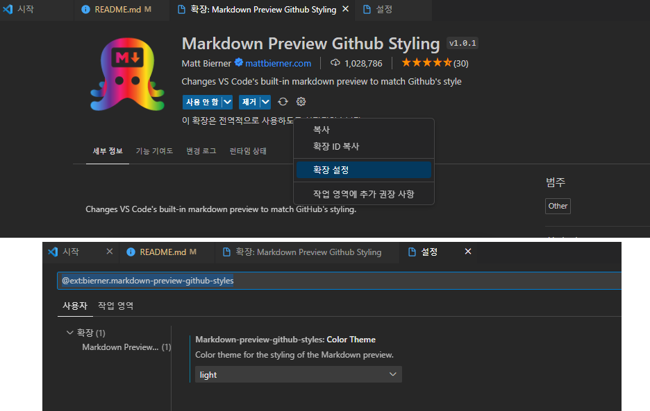

# 마크다운 이것만 알면 된다.
자세한 내용은 이 문서의 소스를 보시면 됩니다. 그리고 익숙해 지려면 약간의 시간을 들여 직접 연습을 해 봐야 다음 부터 원하는 결과를 빠르게 얻으실 수 있습니다. HTML을 아시는 분은 쉽게 적응 하실 수 있습니다.

## 헤드라인 태그의 사용
1. 처럼 순서가 있는 번호는 사용 못한다. * 강조는 **와 붙여야 한다.(공백이 있으면 안된다.)
1. **현재페이지에서 이동하기**
[여기를 클릭하면 글씨체](#글씨체) 하단으로 이동할 수 있다.

```
[보여지는 글](#이동할-위치)
#이동할 위치

[Move Text](#index-text)
  #Index Text
  => 'Index Text' 로 이동하기 위해 '#index-text' 처럼 소문자로 변경 및 띄어쓰기는 '-' 으로 구분했다.
  -   알파벳은 반드시 소문자만 가능
  -   띄어쓰기는 -(하이픈)으로 구분

참고한곳: https://gist.github.com/Curookie/2b7c110e23955b7131afbc76ffd2f724#1-%EB%AA%A9%EC%B0%A81%EB%B2%88-apple
조건: 목차명에 영어는 무조건 소문자, 스페이스가 있을 경우 대신 - 입력
조건: 목차명에 점, 반점, 특수문자, 괄호가 들어갔을 경우 무시해주면 된다.
조건: 목차명은 문자열이 유일해야 해야한다. 유일하지 않으면 가장 가까운 곳으로 가는데 이 때 링크명과 목차명이 같아야 할 때 팁은 위 예제와 같이 [링크명 ] 뒤에 스페이스바로 한 칸 띄어주면 된다.
조건: #으로 제목처리된 곳으로만 갈 수 있다 #이나 ### 처럼 개수는 상관없음. (단, ### 으로 갈때도 목차명에 #한개만 써야함)
```

## 목차: 번호가있는경우
1. 번호가 있을때 .다음에는 한칸공백필요
1. 번호가필요할때**강조**
```
1. 번호가 있을때 .다음에는 한칸공백필요
1. 번호가필요할때**강조**
```

## 목차: 번호가필요없을때
- 번호가 없는 경우는 하이픈 또는 별표
- 줄바꿐은 \<br\>을 사용한다. 태그같이 특수한것은 역슬레쉬를 붙이면 된다.

## 링크 주소
[GOOGLE](https://google.com)<br>
[새 탭 열기](https://www.google.com/, "이걸 누르면 구글로 가요")<br>
<a href="http://example.com/" target="_blank">HTML 링크 그대로 사용하기</a><br>
```
[앵커텍스트](링크주소)
[앵커텍스트](링크주소, "설명")
<a href="http://example.com/" target="_blank">HTML 링크 그대로 사용하기</a>
```

## 이미지
사이즈 조절등이 필요하면 HTML 그대로를 사용해도 됩니다.
```


<p align="center"></p>
```
<!--  -->
<p align="center"></p>


## 글씨체
***굵은기울임*** *기울임* _이탤릭_ ~~취소~~ __강조__ **강조** <u>밑줄</u>

## 수평선(가로줄)
<hr>

---
***
_ _ _

## 인용문
>인용문넣기1
>>인용문2
>>>인용문3

## 표
|th1-헤더 | th2 | th3-헤더
| :-- | :-- | :--
|td1 | td2 | td3
| 정렬 | --: | 우측정렬 |
| 정렬 | :-- | 좌측정렬 |
| 정렬 | :--: | 가운데정렬 - 길이가 길어야 눈에 보인다. |


## 프로그램 언어표시
```php
foreach ($variable as $key => $value) {
  # code...
}
while ($a <= 10) {
  # code...
}

// git 명령 간단하게 한줄 실행하기
//  git add .; git commit -m 'markdown'; git push
```

```javascript
$(document).ready(function()
{
  array.forEach(element => {

  });
});
```
```html
<!DOCTYPE html>
<html lang="en">
<head>
  <meta charset="UTF-8">
  <meta http-equiv="X-UA-Compatible" content="IE=edge">
  <meta name="viewport" content="width=device-width, initial-scale=1.0">
  <title>Document</title>
</head>
<body>

</body>
</html>
```
